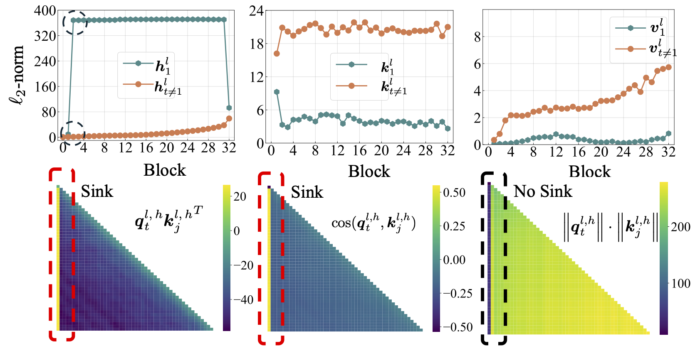
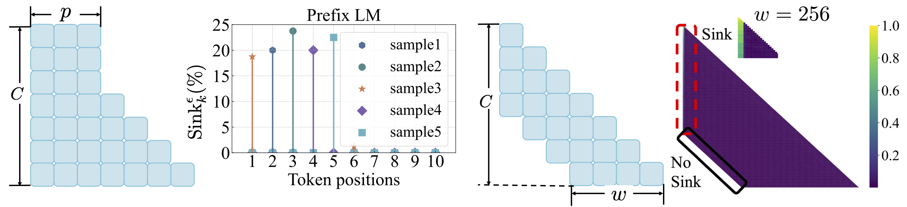
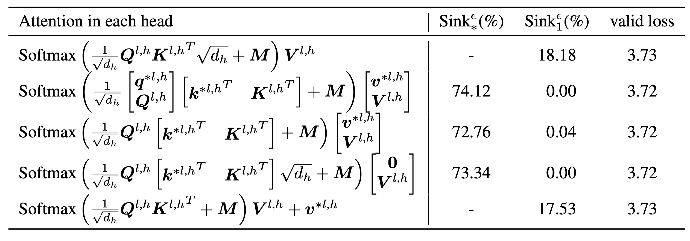
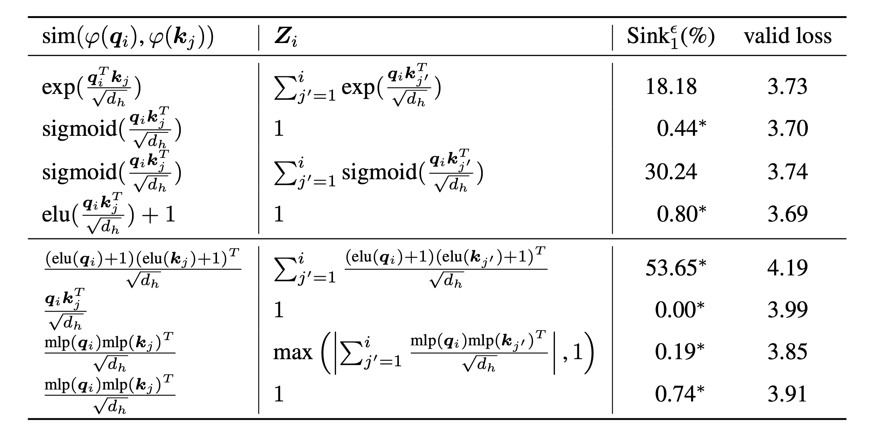

<h1 align='center' style="text-align:center; font-weight:bold; font-size:2.0em;letter-spacing:2.0px;">
                When Attention Sink Emerges in Language Models: An Empirical View </h1>

<p align='left' style="text-align:left;font-size:1.2em;">
<b>
    [<a href="https://arxiv.org/abs/2402.08567" target="_blank" style="text-decoration: none;">arXiv</a>]
</b>
</p>


## TL, DR: 

In this work, we investigate how optimization, data distribution, loss function, and model architecture in LM pre-training influences the emergence of attention sink.


## Setup
We run all our experiments on A100 GPUs with 40GB memory. We follow [TinyLlama](https://github.com/jzhang38/TinyLlama) and [regmix](https://github.com/sail-sg/regmix) to prepare the environments:

### Installation
We expect you have CUDA 11.8 installed.
#### Install Pytorch Nightly.
```bash
pip install --index-url https://download.pytorch.org/whl/nightly/cu118 --pre 'torch>=2.1.0dev'
```
#### Build XFormers from Source
Note: as of 2023/09/02, xformers does not provide pre-built binaries for torch 2.1. You have to build it from source.
```bash
pip uninstall ninja -y && pip install ninja -U
pip install -v -U git+https://github.com/facebookresearch/xformers.git@main#egg=xformers
```


#### Install Flash-Attention 2 and other fused operators:
```bash
git clone https://github.com/Dao-AILab/flash-attention
cd flash-attention
python setup.py install
cd csrc/rotary && pip install .
cd ../layer_norm && pip install .
cd ../xentropy && pip install .
cd ../.. && rm -rf flash-attention
```
#### Install Remaining Dependencies
```
pip install -r requirements.txt tokenizers sentencepiece
```
to install other dependencies.
It may take >= 5 minutes to build xformers/flash-attention. Do not worry if the process seemly stagnant or the terminal print out many warnings.

### Preprocess

Before training the model, you need to preprocess the data. We provide the easy-to-use script for preprocessing the data. You can use the following command to preprocess the data:

```shell
cd preprocess
bash run_preprocess.sh
```

By default you will first download the `regmix-data-sample` from the HuggingFace and then preprocess the data. The JSONL data will be saved in the `preprocess/sail/regmix-data-sample` directory, and the preprocessed data will be saved in the `datasets/lit_dataset_regmix` directory. This includes approximately 5B tokens and takes about 20GB disk space.


### Wandb Integration

By default we use the wandb for collecting the data to avoid saving massive small models and logs on the local machine. If you want to use the wandb, you need to create an account on the [wandb](https://wandb.ai/site) and get the API key. Then you should set the following environment variable in `scripts/*.sh`:

```shell
# wandb project name, entity, and API key
export WANDB_PROJECT=YOUR_PROJECT_NAME
export WANDB_ENTITY=YOUR_WANDB_ENTITY
export WANDB_API_KEY=YOUR_WANDB_API_KEY
```


## Attention sink in open-sourced LMs

<p align="center" width="100%">

</p>

We first conduct comprehensive study on open-sourced LMs, including LLaMA2, LLaMA3, Mistral, GPT2, Pythia, and OPT. We provide the script to calculate the attention sink metric for the above LMs:

```shell
python eval_sink_open_source.py
```

We also provide the script to compute the L2-norm of hidden states, keys and values:

```shell
python eval_activations_open_source.py
```

We note that we include the evaluations of all 30 open-sourced LMs in a single script, which may take a long time to download models. Please modify line 57-63 in `eval_sink_open_source.py` or line 104-110 in `eval_activations_open_source.py` to evaluate specific LMs. 


## Pre-train LLaMA models

We pre-train a series of LLaMA models on 5B token data to investigate how optimization, data, loss function, and model achitecture in LM pre-training affect the attention sink.

Different setups may result in different memory usage, and serveal setups are not well compatible with flash attention. We may have different codebases for model pre-training and inference in the folder `lit_gpt`. We welcome the contributions from the community to make the code more concise and efficient. 

Unless extra instructions, the followed experiments need 4 GPUs with at least 40 GB memory. Please modify the micro batch size in `configs/*.yaml`.

Run the default setup:

```shell
bash scripts/run_default.sh
```

The final checkpoint is saved at `checkpoints/tinyllama_60M/iter-020000-ckpt.pth`.


We provide all the scripts to reproduce our experimental results in the main paper.

* Optimization: refer to `scripts/optimization.md`. Takeaways: 1. Attention sink emerges after LMs are trained effectively. 2. Attention sink appears less obvious in LMs trained with small learning rates.

* Data distribution: refer to `scripts/data_distribution.md`. Takeaways: 1. Attention sink emerges after LMs are trained on sufficient training data. 2. Attention sink could be shifted to other positions rather than the first token if modifying data distribution.

* Loss function: refer to `scripts/loss_function.md`. Takeaways: 1. Weight decay encourages the emergence of attention sink. 2. With prefix language modeling, attention sink appears among the prefix tokens rather than the first token only. 3. With shifted window attention, attention sink appears on the absolute, not the  relative first token. Smaller window size prevents the emergence of attention sink.


<p align="center" width="100%">

</p>


* Model architecture: refer to `scripts/model_architecture.md`. Takeaways: 1. Positional embedding, FFN design, LN location, and multi-head design do not affect the emergence of attention sink. 2. Attention sink acts more like key biases, storing extra attention and meanwhile not contributing to the value computation. 3. When relaxing tokens' inner dependence on attention scores, attention sink does not emerge in LMs.

<p align="center" width="100%">

</p>

<p align="center" width="100%">

</p>


Finally, we scale up the model size to 1B parameters and find still no attention sink and massive activations.

```shell
bash scripts/run_defaults_1b.sh
bash scripts/run_sigmoid_1b.sh
```


# Bibtex
If you find this project useful in your research, please consider citing our paper:

```

```

# Acknowledgements

Our codes are developed based on [TinyLlama](https://github.com/jzhang38/TinyLlama) and [regmix](https://github.com/sail-sg/regmix).